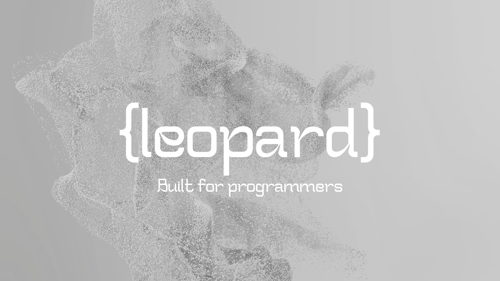

# The Leo Programming Language
---

> At leopard we love GoLang but wanted to give it a fresh start and refine some of the small oddities that occur in the language. All of this while delivering something that at the end of the day is more powerful, comprehensive, and controllable than ever before. With that vision we present to you Leopard. A language that standardizes some of Go's quirks while maintaining its ability to present expressive, shorthand power, and retaining it's preference for style over verbosity. 

> Of course this is just the highest level overview. We've made tons of small changes while retaining 95% of the go syntax. But most importantly we envisioned not making developers have to choose different languages when they decided that for some self-contained package they would like to minimize the presence and activity of the gc routines. With this we implemented a much simplified and easy to understand lifetime variable syntax with safe variables.

> On top of all of this is the sheer power and versatility, Leopard compiles to LLVM and interfaces with the Clang compiler for interopability with external `C` function calls and integration with C shared libraries.

> Leopard is just a little more awesome on top of what already was awesome and we here at dieselsoft hope you love it





# Safe Variables

Here is an example of Leo declaring safe variables (variables that only escape their scope when transferred):

Declare structs as safe. This declaration tells the runtime that these variables are scope sensitive and must be transfered to another authority.


```
safe SafeFoo entity{
    X int
}

func SomeFunc(x int)(*SafeFoo){
    m := SafeFoo{x}
    return m
}

func main(){
    my_safe_pointer <:= SomeFunc(3)

}
```

The above program can be compiled and run with

```
leo build -target wasm src/safe.leo
```

## Safe Programming

Safe programming is explicit programming when a programer allocates a `safe` type variable this allocation occurs on an isolated heap. Isolated heap variables escape GC collection runtimes. For all intensive puroposes safe types which are allocated by value behave similarily to normal types. However pointers to safe types have explicit assignment conditions. These are as follows:

1. In order for a `safe` pointer type to escape its call stack it must be explictly passed with the transfer `<:=` token. This looks like `myVar <:= safeFunction()` and can only be used with pointer types. This effectively assigns the safe type as a pointer to variable of same type in another scope. This is just an addition to be explicit about safe types.

2. Safe types are transferred this way because the `myVar` becomes a new owner and binds to the original pointer. When myVar's scope ends so does the life-time of the original pointer and the safe variable is deleted. 

3. Because safe types can only be attached to one type at a time. It can only be passed to other types by copy. Which means that all safe types should have implemented a method of

```
func (s *MySafeType)Copy()MySafeType{
}
```

4. To copy a variable to another we can use `a <--> b`. To return a copy as a primary expression, i.e. as a function parameter argument we can use `SomeFunc(<b>)`'

5. Lastly and most importantly is when we want the variable to retain static properties. For example we are building a tree with safe types. We can explicitly attach any safe type to any other go type. When that pointer is marked and swept then so is the safe type. To attach a safe type use `<=:` So for example. `MyGraph.root <=: mySafeType`. Now you can pass pointers dealing with my safe type as needed and use it like any other variable but it won't be swept until the GC colleted type is.

> This all follows single owner protocol making working with explicit types easy and well...explicit.

## Overview

> The leo programming language is modeled and built with Go simplicity and flexibility in mind.

This dual purpose language allows the system to run a GC based memory allocation runtime and a explicit Safe object type non-GC'd runtime. In the non-gc runtime object lifetimes are explicitly via transfer of ownership. Single owner responsibility controls the lifetime of objects. 

> Leo adds in other basic features that we believe should have been implemented in the Original GoLang implementation including Operator/Function Overloading, new primitives, constructors, and GPU kernel specification.


Leo parses all existing Go lang features up to version 1.16 and implements these language features in its own GC runtime core. Additional implementations of "safe" variables and their associated bridging and transfer syntax is introduced to avoid GC collection of pointers. 

By writing core systems language objects in their "safe" modes the writers will avoid GC stalls "if" and only if a substantial portion of that system is built using safe declarations. 

## New Langauge features

### Safe declarations 

Declare structs as safe. This declaration tells the runtime that these variables are scope sensitive and must be transfered to another authority.

```
safe SafeFoo entity{
    X int
}

func SomeFunc(x int)(*SafeFoo){
    m := SafeFoo{x}
    return m
}

func main(){
    my_safe_pointer <:= SomeFunc(3)

}
```

## Safe types and lifetimes

So how do safe declarations work? For an example we can look at a safe linked list where all types are safe

```
safe LinkedList<T> entity{
    root *Node<T>
    last *Node<T>
}


safe Node<T> entity{
    T data
    next *Node<T>
    parent *Node<T>
}


method LinkedList<T>.Add(node *Node<T>){
    self.root.last.next = node
    self.root.last = .root.last.next
}

method LinkedList<T>.Remove(node *Node<T>){
    if node.parent != nil{
        node.parent.next = node.next
    }
}
```

This code is perfectly fine in a garbage collected langauge. At some point we lose access to the node object and the garbage collector recognizes this. Unfortunately relying on the garbage collector for these types of operations at scale can be a major drag on system performance. That is why
we need a reliable way to get rid of this type without letting that heap allocated node type  fall through the cracks and cause memory leakage.

We do this through safe types. Safe types are objects whose lifetimes depend on their handlers. We specify this handling through a lifetime transfer: `<:=`. An observer pattern makes the node a subscriber to its handler.

```
method LinkedList<T>.Add(node *Node<T>){
    self.root.last.next = node
    node.parent = self.root.last
    self.root.last = node
    node.parent <:= node
}
```

Now `root` and `last` lifetimes are implicitly held by their wrapper types. 

Now nodes liftetime is transferred to its parent. A deletion of the parent will signal a deletion of the node itself.


```
delete node
```

By definition of lifetimes all nodes to the right of the node will be deleted as well. What would be helpful is to transfer all lifetimes subscribed to this entity to another object
```
parent := node.parent
next := node.next
parent <==> node
delete node
parent.next = next
```

Here prior to deletion of the node we transfer all lifetime subscribers from node to its parent. We can safely delete the node.

This model is designed to be simple. But it doesn't always handle leakage for example if we just reassign the parents next link and there is no
explicit deletion

```
parent.next = node.next
```

Here node is leaked. We would like to at least send a warning that node is no longer accessible. At the very least we can message to all subscribers that the parent was mutated.

```

safe Node<T> entity{
    parent *Node<T>
    next *Node<T>@critical
}


parent.next = node.next

```

The parent lifetime handler needs to notify its subscribers that a critical reference was mutated. Critical annotations can only be attached to pointer types. Unhandled critical events default to panic(). Messages for critical fields are only sent to safe entities that are the same type as the critical field

```
method (this *Node<T>)Critical(field string, value uintptr){
    if field == "next" && value != uintptr(this){
        defer delete this
    }
}
```

Now we can get safely handle the link reassign:

```
parent <--> node
parent.next = node.next
```


This code transfers the the allocated heap variable SafeFoo entity in the enclosing scoped function outside. The return variable is given a chance to transfer the pointer to a currently (or parent) scoped variable. This transfer of responsbility ensures the the original `m` variable
is not deleted by its scope handler and passed on the responsibility to the current scope handler. Scope handling in this way ensures that there is always some scoped handler responsible for a variable.

Note that if you do not specify critical fields in your handler then you still get silent leakage with your declared variables, the safe paradigm at the very least encourages explicit handling of the mutation of references in the lifetime handler to its subscribers.

### Safe Selectors
In GoLang using a selector on a nil valued type causes a runtime panic and adds complexity to program development by adding in layers of nil checks that must be performed prior to any selection. Leo proposes to implicitly evaluate a nil or nil equivlant value of the target type. No syntax adjustments or needed as this is an evaluative property.

Given the following example
```
type Object entity{
    field A
}

type A entity{
    property *B
}

type B entity{
    x *int
}

func main(){
    myObject := Object{field:A{B:nil}}
    myInt := myObject.field.property.x@(nil)
}
```
Assigning `myInt` would encounter a `panic()` routine for accessing a `nil` fielded pointer of type `*B`. Our proposed solution would simply evaluate to the `nil` or `nil` equivlant, in this case for an integer primitive is `0`.

Of course an issue is especially with primitives is silent failure when encountering integers where `0` values are plausible program values. In this case the programmer has the option to specify a failover value with `.x@(expression)` where expression is the type of `x`:

```
myInt := myObject.field.property.x@(-1)
```

If A were nil we would want a way to safely handle using a nil accessor:

```
myObject := Object{field:nil}
myInt := myObject.field.property.x@(-1)
```

This simply states that if there is a nil accessor at some point in this call chain then we can failover to the enclosed expression. This could be a full expression like

```
myInt := myObject.field.property.x@(default_integer(0))
```

Where the function `default_integer(int)` is just a demonstration functin that would return an integer. Failover expressions are the defer statements of nil handled accessors.


### Mathematical Operator Overloading

Additionally leo lang extends go-lang by allowing for Algebraic operator overloading using the `<+>` syntax for example. All return types to the original non-pointer object. 

```
safe Vector entity{
    x []float32
}

//Non mutating vector addition
func (v *Vector)<+>(a Vector, b Vector)(Vector){
    dim := len(a)
    if dim > len(b){
        dim = len(b)
    }

    c := Vector{make([]float32, dim)}

    for x := 0; x < dim; x++{
        c[x] = a[x] + b[x]
    }
    return c
}

func main(){
    a := Vector{[]float32{1,2,3}}
    b := Vector{[]float32{3,2,1}}
    c := a + b
}

```

### Paralellism

Parallel type tasks implied that memory segments may be shared and that the overall structure of the memory instance may need to stay in place. If the parent thread is able to block and wait for threads to execute then the block will exist but if the scope exits then the memory will be marked for deletion prematurely. It is advised that concurrent threads execute with standard memory objects only.

### Function Overloading

In addition to this leo lang also allows for overloaded functions this works by hashing paramter constructs into the function names however,
all overloaded functions must return the same variable set and types.


### GPU Kernel Functions

Leo language will be one of the very first systems levels languages to natively support GPU Compute Kernels implicitly without any additional required libraries or extensions. GPU support will be a first class language future with Leo compiling directly to AMD/NVIDIA GPU chipsets by running declared kernel functions. We have a 
new keyword GPU where `@GPU` is the GPU initialization procedure which returns a memory arena which returns a `@GPUMemory` type. 

The kernel determines indexes from the `GPU` identifier within kernel functions for access to some global parameters.

GPU memory is unmanaged memory so users will be advised to implement their own sub-allocators.

```
type MyKernelStruct entity{
    d []int
}
memory_arena = 1024*SIZE_BYTE
devices_desired = 1
thread_grouping := @GPUKernelRuntime{3,3,3}
memory := @GPU("NVIDIA-RT1080",devices_desired, thread_grouping, memory_arena, *MyKernelStruct)

func @MyComputeKernel(a int, b int, c int, memory @GPUMemory)(*ReturnMemory){
    memory[GPU.kernel.global_index] =  a + b + c  
}
```


### Prototypes

Dependency injection packages go to great lengths to decouple  imiplementations  of classes from their dependencies and required reflection
and third party libraries to accomplish this. Leo accomplishes this with archetyes, these are simple returned interface default function object callers which can be set by  a calling package for unit testing and API testing purposes.


```
type Automobile interface{
    Drive()int
    Park()string
    Identity()string
}

proto my_car Automobile

my_car.Drive() = func()int{
    return 1
}
```

###Package exported identifiers/symbols

We modify the GoLang specification for the privatization of identifiers. Rather than rely on character case we allow the explicit privatization and export of identifiers
and therefore allow choice. Private fields are always package wide. We also allow private vars to have an optional export to subpackages.

```
type MyStruct entity{
    
    var1, var2 string //private

    Var1, Var2 string //public

    public:
    a,b,c,d int

    private(test, bench):
        x,y,z float32
}
```


###Package coupling

One of the things GoLang doesn't allow is cyclical dependencies for packages and direct descendents. We allow package coupling with the import clauses where packages
are now coupled if need be

```
package parser

import -> "lexer"

... //implement parser


package lexer

import <- "parser"

... //Implement lexer
```

Here we denote which package is subordinate and which is parental in the coupling. The subordinate package will make a generic reservation for contract fullfillment when encountering a parent definition that relies on its implementation.

For example `lexer` will encounter `parser.parse()int` and will reserve a functional address location for the method call. The parent package will recieve any reservations and fullfill the contract at the specified location when it encounters the definition for parse.


### Future Additions

We plan to make package and module support as spectacular as Go's package and versioning manaager and will include further support in the near future.


### Built-In Functions

Built is functions are pred-declared, called like other functions although some accept a type instead of an expression.


| Call | Argument | Result |
| ---- | -------  | -----  |
| len(s) | string type | string length in bytes |
| | [n]T, *[n]T | array length n | 
| | []T | slice length |
| | map[K]T | map length | 
| | chan T | number of elements queued in channel buffer | 
| cap(s) | [n]T, *[n]T | array length |
| | []T | slice capacity |
| | chan T | channel buffer capacity | 
| | type parameter | length or capacity of the respecitve type for each valid type in the set |
| new(T)| T is a type | allocates storage for a vriable of that type and returns a value of type * T | 
| make([]Type, n, m) | A type of length n and capacity m | Returns a slice |
| make(Map[Key][Value], n ) | Map type declaration and capcity N | Returns a Map | 
| make(T) | Channel | Unbuffered channel of Type T | 
| make(T, n) | Channel | Buffered channel of Type T | 
| append(s S, x ... E) S | s is the original slice and X is either a slice to append if singular or a sequence of elements to append if multiple | returns the slice | 
| copy(dst []T, src[]T) int | dst and src are slices of type T | elements of src are copied into dst | 
| delete(m, k) | m is the map and k is the key | deletes an item from a Map |
| complex(realPar, imaginaryPart floatT) complexT | floating point parts of complex | constructs complex number |
|real(complexT) floatT | complex number | returns a real part float | 
|imag(complexT) floatT | complex number | returns a imag part float |
|panic(interface{}) | primitive or error type | panics and exits, executes deferred |
|protect(g func()) | function to call | invokes function argument `g` and protects callers from run-time panics raised by `g()` |
|recover() interface{} |  None | Stops a panic sequence when called as a deferred function of the panic caller (unless the function that called recover is itself panicking).


